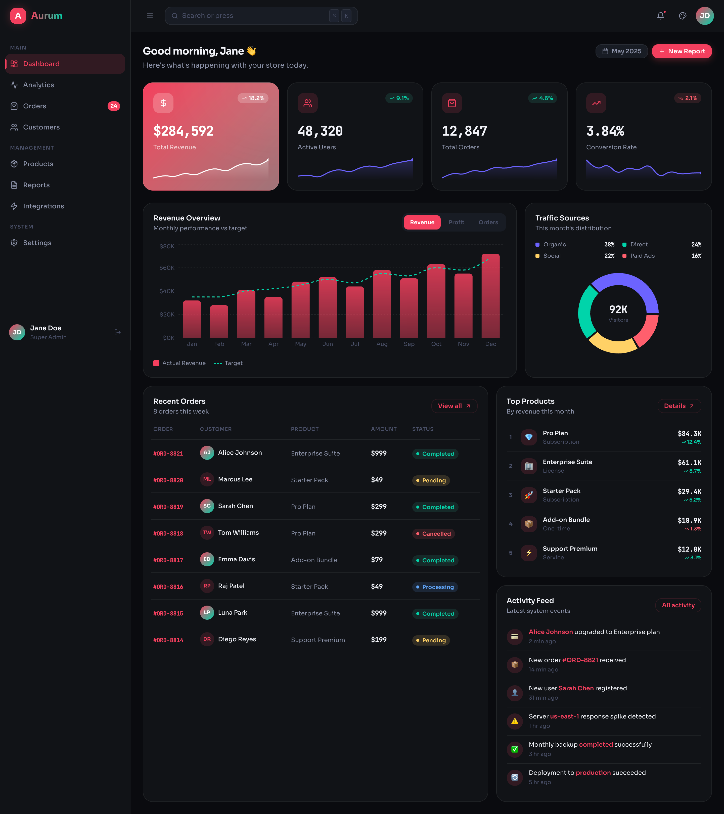
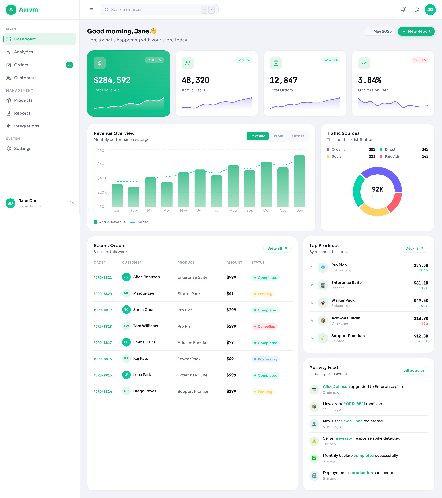

# ✨ Aurum — Luxury SaaS Admin Dashboard

<div align="center">


<p>
  <strong>A premium, production-ready SaaS admin dashboard built with React, TypeScript, and Tailwind CSS.</strong><br/>
  Featuring a powerful multi-theme system, command palette, interactive charts, and a fully responsive design.
</p>

[](./LICENSE)
[](https://react.dev)
[](https://www.typescriptlang.org)
[](https://tailwindcss.com)
[](https://vitejs.dev)

</div>

---

## 🖼️ Screenshots

| Dark Mode | Light Mode |
|-----------|------------|
|  |  |
---

## ✨ Features

### 🎨 UI / UX
- **Luxury design language** — soft shadows, glass effects, gradients, smooth micro-interactions
- **Fully responsive** — mobile drawer sidebar, adaptive grid layouts, touch-friendly
- **Loading skeletons** — shimmer placeholders on every widget while data loads
- **Smooth animations** — staggered card entrances, slide-downs, fade-ins

### 🌗 Theme System
- **Light / Dark mode** with smooth transitions
- **5 accent color themes** — Purple, Emerald, Rose, Amber, Blue
- Preferences saved to `localStorage` and applied instantly on reload
- CSS custom properties (design tokens) power every color in the UI

### ⌨️ Command Palette (`⌘K` / `Ctrl+K`)
- Fuzzy search across all navigation, actions, and theme commands
- Keyboard navigation (↑↓ arrows + Enter)
- Instant theme switching without opening settings

### 📊 Dashboard Widgets
| Widget | Details |
|--------|---------|
| **KPI Cards** | Revenue, Users, Orders, Conversion — each with a smooth canvas sparkline |
| **Revenue Chart** | Bar + line combo (Recharts) — switchable Revenue / Profit / Orders view |
| **Traffic Donut** | Source breakdown with custom tooltip |
| **Orders Table** | Sortable columns, status badges, avatars |
| **Top Products** | Ranked by revenue with % change indicators |
| **Activity Feed** | Live-style event timeline |
| **Notifications** | Dropdown with unread dots and mark-all-read |

### 🧱 Component Architecture
- Fully reusable `Button`, `Badge`, `Card`, `Avatar`, `Tooltip`, `Modal` primitives
- Collapsible sidebar with tooltip labels in collapsed state
- `useSidebar`, `useTheme`, `useCommandPalette` custom hooks
- Mock data system in `src/lib/mockData.ts` — swap for real API with zero UI changes

---

## 🛠 Tech Stack

| Layer | Technology |
|-------|-----------|
| Framework | React 18 + TypeScript |
| Build Tool | Vite 5 |
| Styling | Tailwind CSS 3 + CSS Variables |
| Charts | Recharts 2 |
| Icons | Lucide React |
| Canvas Sparklines | Native HTML5 Canvas |
| State | React hooks (no external state library needed) |

---

## 🚀 Getting Started

### Prerequisites
- Node.js **18+**
- npm / yarn / pnpm

### Installation

```bash
# 1. Clone the repository
git clone https://github.com/ICodingStack/aurum-dashboard.git
cd aurum-dashboard

# 2. Install dependencies
npm install

# 3. Start the dev server
npm run dev
```

Open [http://localhost:5173](http://localhost:5173) in your browser.

### Build for Production

```bash
npm run build
npm run preview
```

---

## 📁 Project Structure

```
aurum-dashboard/
├── public/
│   └── favicon.svg
├── src/
│   ├── components/
│   │   ├── ui/                  # Primitive components
│   │   │   ├── Badge.tsx
│   │   │   ├── Button.tsx
│   │   │   ├── Card.tsx
│   │   │   ├── Avatar.tsx
│   │   │   ├── Tooltip.tsx
│   │   │   └── Modal.tsx
│   │   ├── layout/              # Shell components
│   │   │   ├── Sidebar.tsx
│   │   │   ├── Navbar.tsx
│   │   │   └── CommandPalette.tsx
│   │   ├── charts/              # Chart widgets
│   │   │   ├── RevenueChart.tsx
│   │   │   └── TrafficChart.tsx
│   │   └── dashboard/           # Dashboard-specific widgets
│   │       ├── KPICards.tsx
│   │       ├── OrdersTable.tsx
│   │       └── FeedWidgets.tsx
│   ├── features/
│   │   └── analytics/
│   │       ├── DashboardPage.tsx
│   │       └── PlaceholderPages.tsx
│   ├── hooks/
│   │   ├── useTheme.ts          # Theme context + hook
│   │   ├── useSidebar.ts
│   │   └── useCommandPalette.ts
│   ├── lib/
│   │   ├── mockData.ts          # Typed mock data system
│   │   └── utils.ts             # cn(), formatters, helpers
│   ├── styles/
│   │   └── globals.css          # Design tokens + Tailwind base
│   ├── App.tsx                  # Root component + routing
│   └── main.tsx                 # Entry point
├── index.html
├── tailwind.config.js
├── tsconfig.json
├── vite.config.ts
├── LICENSE
└── README.md
```

---

## ⌨️ Keyboard Shortcuts

| Shortcut | Action |
|----------|--------|
| `⌘K` / `Ctrl+K` | Open command palette |
| `⌘B` / `Ctrl+B` | Toggle sidebar |
| `Esc` | Close any overlay |
| `↑` / `↓` | Navigate command palette |
| `Enter` | Execute selected command |

---

## 🎨 Customization

### Adding a New Color Theme

1. Add a new entry in `src/styles/globals.css`:
```css
[data-color="teal"] { --accent:#14b8a6; --accent-soft:rgba(20,184,166,0.14); --accent-glow:rgba(20,184,166,0.28); }
```

2. Add the color to `ACCENT_COLORS` in `src/components/layout/Navbar.tsx`
3. Add it to the command palette in `src/components/layout/CommandPalette.tsx`

### Connecting to a Real API

Replace the mock data in `src/lib/mockData.ts` with API calls. The components consume typed interfaces, so swapping the data source requires no UI changes:

```typescript
// Before (mock)
import { kpiData } from '@/lib/mockData'

// After (real API)
const { data: kpiData, isLoading } = useQuery(['kpis'], fetchKPIs)
```

---

## 📄 License

This project is licensed under the **MIT License** — see [LICENSE](./LICENSE) for details.

---

**Made with love ❤️ by [BlackBirdo](https://blackbirdo.com)**

